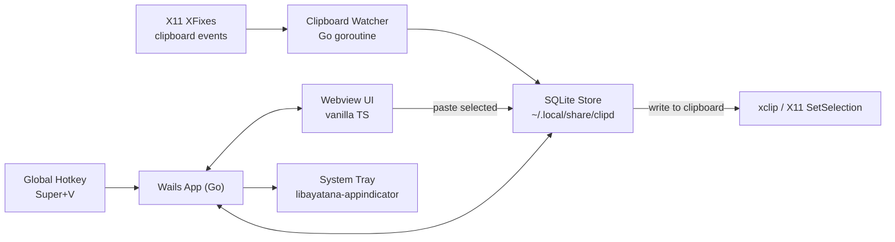

# Linux Clipboard History App — Build Plan

## Goal
A Windows+V-style clipboard manager for X11 Linux (Debian/Ubuntu) with text + image history, pinning, search, global hotkey, system tray, autostart, and persistent storage. Target binary size: ~12-18MB.

## Architecture



## Tech Stack

- **Backend:** Go 1.22+ with Wails v2 (`github.com/wailsapp/wails/v2`)
- **Frontend:** Vanilla TypeScript + HTML + CSS (Vite bundling, auto-included by Wails)
- **DB:** SQLite via `modernc.org/sqlite` (pure-Go, no CGO → small + portable binary)
- **Clipboard read/write:** `golang.design/x/clipboard` (text + image)
- **Clipboard change events:** X11 `XFixes` extension via `github.com/jezek/xgb` (no polling, true event-driven)
- **Global hotkey:** `golang.design/x/hotkey` (X11 `XGrabKey` under the hood)
- **System tray:** `github.com/getlantern/systray` (uses libayatana-appindicator on Ubuntu)
- **Image thumbnails:** stdlib `image/png` + nearest-neighbor downscale
- **Packaging:** `nfpm` (single config → `.deb`) + plain tarball

## Project Structure

```
clipboard/
├── go.mod
├── main.go                       # Wails app entry
├── wails.json                    # Wails config
├── nfpm.yaml                     # .deb packaging
├── build/
│   ├── appicon.png
│   └── linux/                    # .desktop file, autostart template
├── internal/
│   ├── db/
│   │   ├── db.go                 # SQLite open + migrations
│   │   ├── schema.sql            # tables: items, settings
│   │   └── queries.go            # CRUD: add, list, pin, delete, search
│   ├── clipboard/
│   │   ├── watcher_x11.go        # XFixes event loop → emits change events
│   │   ├── writer.go             # set clipboard from a stored item
│   │   └── types.go              # ContentType enum, Item struct
│   ├── hotkey/
│   │   └── hotkey.go             # register Super+V, callback
│   ├── tray/
│   │   └── tray.go               # system tray icon + menu
│   ├── service/
│   │   └── service.go            # Go methods bound to JS (Wails Bind)
│   └── config/
│       └── config.go             # XDG paths, settings load/save
├── frontend/
│   ├── index.html                # popup root
│   ├── src/
│   │   ├── main.ts               # bootstrap
│   │   ├── api.ts                # typed wrappers around Wails bindings
│   │   ├── components/
│   │   │   ├── itemList.ts       # renders history list (virtual scroll if >500)
│   │   │   ├── searchBar.ts
│   │   │   ├── settingsModal.ts
│   │   │   └── itemContextMenu.ts
│   │   └── styles/
│   │       ├── main.css          # CSS variables, light/dark via prefers-color-scheme
│   │       └── components.css
│   ├── package.json
│   ├── tsconfig.json
│   └── vite.config.ts
└── README.md
```

## Data Model

`internal/db/schema.sql`:

```sql
CREATE TABLE IF NOT EXISTS items (
  id           INTEGER PRIMARY KEY AUTOINCREMENT,
  content_type TEXT NOT NULL,         -- 'text' | 'image'
  text_content TEXT,                  -- nullable for images
  image_blob   BLOB,                  -- nullable for text (PNG bytes)
  image_thumb  BLOB,                  -- small PNG thumbnail (~128px)
  content_hash TEXT NOT NULL UNIQUE,  -- sha256 → dedupe + move-to-top
  pinned       INTEGER NOT NULL DEFAULT 0,
  created_at   INTEGER NOT NULL,
  last_used_at INTEGER NOT NULL
);
CREATE INDEX IF NOT EXISTS idx_items_pinned_last_used ON items(pinned DESC, last_used_at DESC);
CREATE VIRTUAL TABLE IF NOT EXISTS items_fts USING fts5(text_content, content=items, content_rowid=id);

CREATE TABLE IF NOT EXISTS settings (
  key   TEXT PRIMARY KEY,
  value TEXT NOT NULL
);
```

Default settings rows: `hotkey=Super+V`, `max_items=200`, `keep_images=true`, `theme=auto`.

## Backend ↔ Frontend Bindings (Wails)

Bound on `service.Service` struct (exposed to JS via Wails `Bind`):

- `ListItems(filter string, limit int) []Item`
- `PasteItem(id int64) error` — writes to clipboard, closes popup
- `PinItem(id int64, pinned bool) error`
- `DeleteItem(id int64) error`
- `ClearAll(keepPinned bool) error`
- `GetSettings() Settings`
- `UpdateSettings(s Settings) error`
- `HidePopup()` / event `clipboard:new-item` pushed via Wails event bus

## UX Flow

1. App starts → registers global hotkey, starts XFixes watcher, starts tray icon. Window is hidden.
2. New clipboard content → watcher dedupes via SHA-256 hash → inserts/bumps row → emits Wails event `clipboard:new-item` (UI updates if visible).
3. User presses `Super+V` → Wails shows window centered on focused screen, frameless, on-top, ~480x560px.
4. List renders pinned section then recent. Auto-focus search bar.
5. Click item or `Enter` on selection → backend writes to clipboard → window hides → user pastes with `Ctrl+V`.
6. Right-click item or hover gear → pin/unpin, delete.
7. `Esc` hides window. Window also hides on blur.

## Packaging

`nfpm.yaml` produces `clipd_0.1.0_amd64.deb` with:
- Binary at `/usr/bin/clipd`
- Icon at `/usr/share/icons/hicolor/256x256/apps/clipd.png`
- `.desktop` at `/usr/share/applications/clipd.desktop`
- Autostart `.desktop` (X-GNOME-Autostart-enabled=true) copied to `~/.config/autostart/clipd.desktop` post-install (or user toggles via Settings UI)
- Depends: `libwebkit2gtk-4.1-0`, `libayatana-appindicator3-1`, `xclip` (fallback)

## Build & Run

```bash
wails dev              # hot-reload during development
wails build -clean     # produces ./build/bin/clipd
nfpm pkg --packager deb --target ./dist/   # produces .deb
```

## Risks & Notes

- **Image dedupe**: hashing full PNG bytes is exact; we won't dedupe visually identical but re-encoded images. Acceptable for v1.
- **Memory**: cap image size in DB (e.g. reject >5MB images by default, configurable).
- **XFixes fallback**: if XFixes init fails (rare on modern X11), fall back to 500ms polling.
- **Wayland**: deferred to v2. We will gate clipboard watcher behind `XDG_SESSION_TYPE=x11` check at startup with a clear error toast for Wayland sessions.
